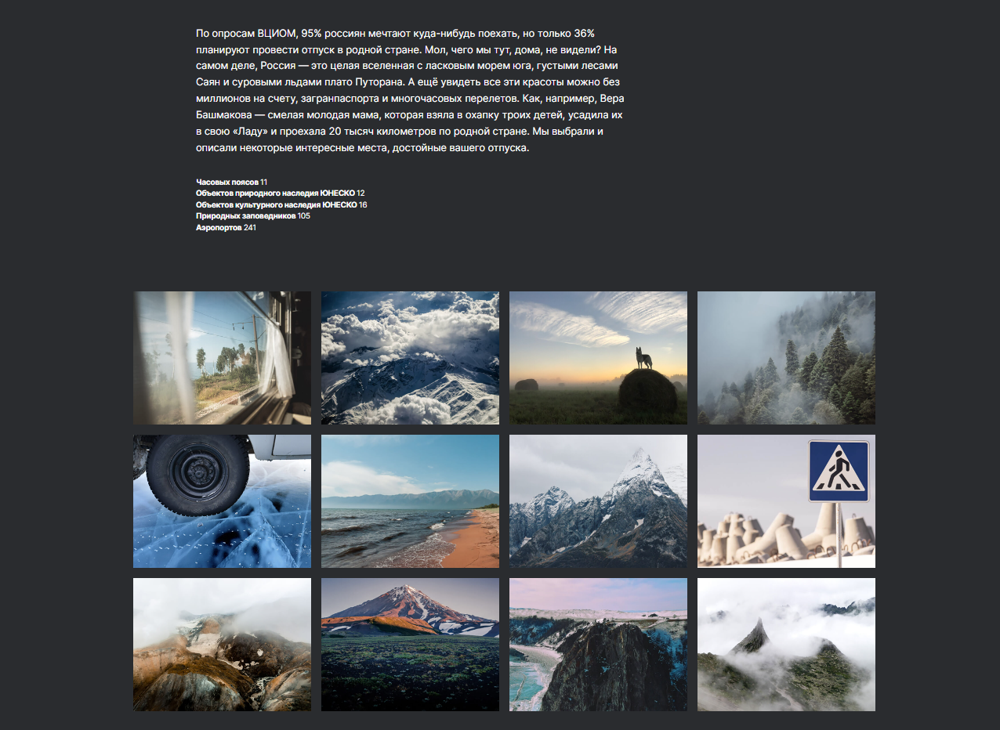

# Проект: Путешествие по России
## Ссылка для просмотра *https://godsdan.github.io/russian-travel/*

 По состоянию на 25 июня 2023 года в России насчитывается 1119 городов. Масштабно, неправда ли? 

### Хватит наслаждаться курортами других стран, погнали изучать Россию!

 В данном проекте я хочу посоветовать те места, которые точно заслуживают вашего внимания. 

## Примеры и технологии

*Шапка сайта:*

 В проекте реализовано построение блоков с помощью *Grid*.

 

 ## Планы по доработке

 1. Дополнить проект инетерсными местами для посещения.

 2. Добавить анимацию